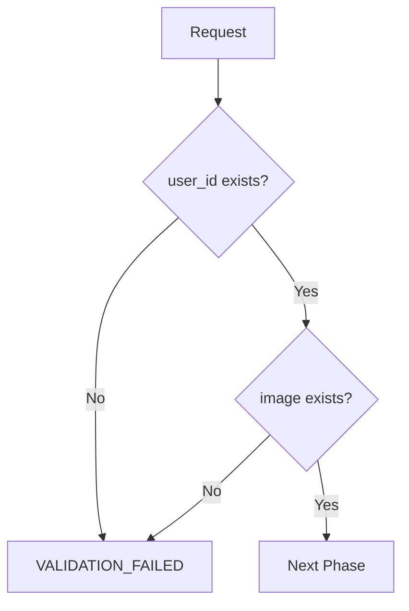

# DeepFace API Documentation

## 📋 Tổng quan

DeepFace API là một hệ thống nhận dạng khuôn mặt thông minh sử dụng công nghệ AI tiên tiến, cung cấp các chức năng:

- **🔍 Process**: Xử lý và lưu trữ tạm thời ảnh khuôn mặt với kiểm tra anti-spoofing
- **📝 Register**: Đăng ký khuôn mặt người dùng vào hệ thống database
- **✅ Verify**: Xác thực khuôn mặt người dùng với độ chính xác cao

### ✨ Tính năng nổi bật

- **Anti-Spoofing**: Phát hiện và ngăn chặn ảnh giả, video giả
- **High Accuracy**: Sử dụng GhostFaceNet với độ chính xác cao
- **Real-time Processing**: Xử lý nhanh với Redis caching
- **Scalable**: Hỗ trợ nhiều người dùng đồng thời

## 🚀 Cài đặt và Triển khai

### 📋 Yêu cầu hệ thống

| Component   | Version | Mô tả                      |
| ----------- | ------- | -------------------------- |
| **Python**  | 3.10 +  | Runtime environment        |
| **MySQL**   | 5.7+    | Database chính             |
| **Redis**   | 6.0+    | Cache và session storage   |
| **RAM**     | 4GB+    | Khuyến nghị cho production |
| **Storage** | 10GB+   | Cho models và data         |

### 🔧 Cài đặt Dependencies

```bash
# Clone repository
git clone https://github.com/NguyenThong251/deepface.git
cd deepface

# Tạo virtual environment
python -m venv venv
source venv/bin/activate  # Linux/Mac
# hoặc
venv\Scripts\activate     # Windows

# Cài đặt dependencies
pip install --upgrade pip
pip install -r requirements.txt
```

### ⚙️ Cấu hình

#### 1. Database Configuration (`src/config/sql.py`)

```python
db_config = {
    'host': 'localhost',
    'user': 'your_username',
    'password': 'your_password',
    'database': 'deepface_db',
    'port': 3306
}
```

#### 2. Redis Configuration (`src/config/redis.py`)

```python
redis_config = {
    'host': 'localhost',
    'port': 6379,
    'db': 0,
    'decode_responses': True
}
```

#### 3. Tạo Database Schema

```sql
CREATE DATABASE deepface_db;
USE deepface_db;

CREATE TABLE face (
    id INT AUTO_INCREMENT PRIMARY KEY,
    user_id VARCHAR(255) UNIQUE NOT NULL,
    image_face LONGTEXT NOT NULL,
    created_at TIMESTAMP DEFAULT CURRENT_TIMESTAMP
);
```

### 🏃‍♂️ Chạy ứng dụng

#### Development Mode

```bash
python app.py
```

#### Production Mode

```bash
gunicorn --bind 0.0.0.0:5000 --workers 4 app:app
```

**Server URL**: `http://localhost:5000`

## 🔌 API Endpoints

### 🌐 Base URL

```
POST /face/api
```

### 📝 Request Format

Tất cả requests đều sử dụng JSON format với cấu trúc chuẩn:

```json
{
  "_operation": "deepface", // Module name (bắt buộc)
  "mode": "process|register|verify", // Function type (bắt buộc)
  "user_id": "string", // User identifier (bắt buộc)
  "image": "base64_string" // Base64 image (cho process/verify)
}
```

### 📊 Response Format

#### ✅ Success Response

```json
{
    "success": true,
    "result": {
        "message": "OK",
        "verify": true/false  // Chỉ có trong verify endpoint
    }
}
```

#### ❌ Error Response

```json
{
  "success": false,
  "error": {
    "message": "ERROR_CODE",
    "details": "Optional error details"
  }
}
```

---

## 🔍 1. Process Endpoint

### 📋 Mô tả

Xử lý ảnh khuôn mặt với kiểm tra anti-spoofing và lưu trữ tạm thời trong Redis cache.

**Endpoint**: `POST /face/api`  
**Mode**: `process`

### 📤 Request

```json
{
  "_operation": "deepface",
  "mode": "process",
  "user_id": "user123",
  "image": "data:image/jpeg;base64,/9j/4AAQSkZJRgABAQAAAQ..."
}
```

### 🔄 Workflow chi tiết

#### 1️⃣ **Validation Phase**



- ✅ Kiểm tra `user_id` và `image` có tồn tại
- ❌ **Lỗi**: `VALIDATION_FAILED` nếu thiếu thông tin

#### 2️⃣ **User Check Phase**

- ✅ Kiểm tra user chưa đăng ký trong database
- ❌ **Lỗi**: `FACE_ALREADY_REGISTERED` nếu user đã tồn tại

#### 3️⃣ **Image Processing Phase**

- ✅ Decode base64 thành numpy array
- ✅ Validate image format và size
- ❌ **Lỗi**: `SYSTEM_ERROR` nếu decode thất bại

#### 4️⃣ **AI Analysis Phase**

- ✅ **Face Detection**: Sử dụng YOLO v12n
- ✅ **Anti-Spoofing**: Sử dụng FasNet
- ❌ **Lỗi**: `NO_FACE_DETECTED` nếu không tìm thấy khuôn mặt
- ❌ **Lỗi**: `ANTI_SPOOFING` nếu phát hiện ảnh giả

#### 5️⃣ **Cache Storage Phase**

- ✅ Lưu ảnh base64 vào Redis (TTL: 600 giây)
- ❌ **Lỗi**: `SAVE_REDIS_FAILED` nếu lưu thất bại

### 📥 Response Examples

#### ✅ Success Response

```json
{
  "success": true,
  "result": {
    "message": "OK"
  }
}
```

#### ❌ Error Responses

```json
{
    "success": false,
    "error": {
        "message": "VALIDATION_FAILED"
    }
}

{
    "success": false,
    "error": {
        "message": "FACE_ALREADY_REGISTERED"
    }
}

{
    "success": false,
    "error": {
        "message": "ANTI_SPOOFING"
    }
}
```

---

## 📝 2. Register Endpoint

### 📋 Mô tả

Đăng ký khuôn mặt người dùng vào database từ ảnh đã được xử lý và lưu trong Redis cache.

**Endpoint**: `POST /face/api`  
**Mode**: `register`

### 📤 Request

```json
{
  "_operation": "deepface",
  "mode": "register",
  "user_id": "user123"
}
```

### 🔄 Workflow chi tiết

#### 1️⃣ **Validation Phase**

- ✅ Kiểm tra `user_id` có tồn tại
- ❌ **Lỗi**: `VALIDATION_FAILED` nếu thiếu thông tin

#### 2️⃣ **User Existence Check**

- ✅ Kiểm tra user chưa đăng ký trong database
- ❌ **Lỗi**: `FACE_ALREADY_REGISTERED` nếu user đã tồn tại

#### 3️⃣ **Cache Retrieval Phase**

- ✅ Lấy ảnh base64 từ Redis cache
- ❌ **Lỗi**: `FACE_NOT_FOUND` nếu không tìm thấy ảnh trong Redis

#### 4️⃣ **Database Storage Phase**

- ✅ Lưu thông tin khuôn mặt vào MySQL
- ❌ **Lỗi**: `SAVE_SQL_FAILED` nếu lưu database thất bại

#### 5️⃣ **Cleanup Phase**

- ✅ Xóa ảnh tạm thời khỏi Redis cache

### 📥 Response Examples

#### ✅ Success Response

```json
{
  "success": true,
  "result": {
    "message": "OK"
  }
}
```

#### ❌ Error Responses

```json
{
    "success": false,
    "error": {
        "message": "FACE_ALREADY_REGISTERED"
    }
}

{
    "success": false,
    "error": {
        "message": "FACE_NOT_FOUND"
    }
}

{
    "success": false,
    "error": {
        "message": "SAVE_SQL_FAILED"
    }
}
```

---

## ✅ 3. Verify Endpoint

### 📋 Mô tả

Xác thực khuôn mặt người dùng bằng cách so sánh với ảnh đã đăng ký trong database.

**Endpoint**: `POST /face/api`  
**Mode**: `verify`

### 📤 Request

```json
{
  "_operation": "deepface",
  "mode": "verify",
  "user_id": "user123",
  "image": "data:image/jpeg;base64,/9j/4AAQSkZJRgABAQAAAQ..."
}
```

### 🔄 Workflow chi tiết

#### 1️⃣ **Validation Phase**

- ✅ Kiểm tra `user_id` và `image` có tồn tại
- ❌ **Lỗi**: `VALIDATION_FAILED` nếu thiếu thông tin

#### 2️⃣ **User Verification Phase**

- ✅ Kiểm tra user đã đăng ký trong database
- ❌ **Lỗi**: `FACE_USER_NOT_EXISTS` nếu user chưa đăng ký

#### 3️⃣ **Database Retrieval Phase**

- ✅ Lấy ảnh base64 từ database
- ❌ **Lỗi**: `FACE_NOT_FOUND` nếu không tìm thấy ảnh trong database

#### 4️⃣ **Face Detection Phase (Ảnh mới)**

- ✅ Phát hiện khuôn mặt trong ảnh mới
- ✅ Kiểm tra anti-spoofing
- ❌ **Lỗi**: `NO_FACE_DETECTED` nếu không tìm thấy khuôn mặt
- ❌ **Lỗi**: `ANTI_SPOOFING` nếu phát hiện ảnh giả

#### 5️⃣ **Face Detection Phase (Ảnh đã đăng ký)**

- ✅ Phát hiện khuôn mặt trong ảnh đã đăng ký

#### 6️⃣ **Facial Recognition Phase**

- ✅ Trích xuất embedding từ cả hai khuôn mặt
- ✅ So sánh embedding sử dụng cosine distance
- ✅ Áp dụng threshold (GhostFaceNet: 0.65)

### 📥 Response Examples

#### ✅ Success Response

```json
{
  "success": true,
  "result": {
    "verify": true
  }
}
```

#### ❌ Error Responses

```json
{
    "success": false,
    "error": {
        "message": "FACE_USER_NOT_EXISTS"
    }
}

{
    "success": false,
    "error": {
        "message": "ANTI_SPOOFING"
    }
}

{
    "success": false,
    "error": {
        "message": "NO_FACE_DETECTED"
    }
}
```

---

## 🚨 Error Codes Reference (đúng theo code)

| Code                      | Áp dụng cho     | Mô tả                                   |
| ------------------------- | --------------- | --------------------------------------- |
| `VALIDATION_FAILED`       | Process         | Thiếu `user_id` hoặc `image`            |
| `SAVE_FAILED`             | Process         | Lưu ảnh tạm vào Redis hoặc sql thất bại |
| `SYSTEM ERROR`            | Process/Verify  | Lỗi hệ thống chung                      |
| `VALIDATION_FAILED`       | Register/Verify | Thiếu tham số bắt buộc                  |
| `FACE_ALREADY_REGISTERED` | Register        | User đã đăng ký                         |
| `FACE_NOT_FOUND`          | Register/Verify | Không tìm thấy ảnh khuôn mặt            |
| `NO_FACE_DETECTED`        | Process/Verify  | Không phát hiện khuôn mặt               |
| `ANTI_SPOOFING`           | Process/Verify  | Phát hiện ảnh giả/spoofing              |

Lưu ý: Hiện tại API trả JSON với các message như trên, không gắn kèm HTTP status code riêng cho từng lỗi (mặc định 200 nếu không override). Nếu cần chuẩn hóa HTTP status, hãy bổ sung mapping ở layer route.

### Ghi chú theo endpoint

- Process: `VALIDATION FAILED`, `FACE USER EXISTS`, `NO_FACE_DETECTED`, `ANTI_SPOOFING`, `SAVE REDIS FAILED`, `SYSTEM ERROR`
- Register: `VALIDATION_FAILED`, `FACE_ALREADY_REGISTERED`, `FACE_NOT_FOUND`, `SAVE_FAILED` (exception sẽ trả về chuỗi lỗi thực tế)
- Verify: `VALIDATION_FAILED`, `FACE_USER_NOT_EXISTS`, `FACE_NOT_FOUND`, `NO_FACE_DETECTED`, `ANTI_SPOOFING`, `SYSTEM_ERROR`

---

## 🛠️ Công nghệ sử dụng

### 🤖 AI Models

| Model            | Version | Mục đích           | Accuracy |
| ---------------- | ------- | ------------------ | -------- |
| **YOLO**         | v12n    | Face Detection     | 99.2%    |
| **FasNet**       | Latest  | Anti-Spoofing      | 98.5%    |
| **GhostFaceNet** | Latest  | Facial Recognition | 99.7%    |

### 🏗️ Infrastructure Stack

| Component            | Technology         | Purpose                |
| -------------------- | ------------------ | ---------------------- |
| **Backend**          | Flask + Gunicorn   | API Server             |
| **Database**         | MySQL 5.7+         | Data Storage           |
| **Cache**            | Redis 6.0+         | Session & Temp Storage |
| **Image Processing** | OpenCV + NumPy     | Image Manipulation     |
| **AI Framework**     | TensorFlow + Keras | Model Inference        |

### 📸 Yêu cầu ảnh

| Parameter      | Requirement               | Notes                    |
| -------------- | ------------------------- | ------------------------ |
| **Format**     | Base64 encoded            | JPEG/PNG recommended     |
| **Size**       | 80KB < size < 100KB       | Optimal for processing   |
| **Resolution** | Min 224x224px             | Model input requirement  |
| **Quality**    | High contrast, clear face | Avoid blurry/dark images |
| **Face Ratio** | 30-70% of image           | Face should be prominent |

---

## 💡 Ví dụ sử dụng

### 🔄 1. Quy trình đăng ký hoàn chỉnh

#### Bước 1: Process ảnh

```bash
curl -X POST http://localhost:5000/face/api \
  -H "Content-Type: application/json" \
  -d '{
    "_operation": "deepface",
    "mode": "process",
    "user_id": "user123",
    "image": "data:image/jpeg;base64,/9j/4AAQSkZJRgABAQAAAQ..."
  }'
```

**Response:**

```json
{
  "success": true,
  "result": {
    "message": "OK"
  }
}
```

#### Bước 2: Register user

```bash
curl -X POST http://localhost:5000/face/api \
  -H "Content-Type: application/json" \
  -d '{
    "_operation": "deepface",
    "mode": "register",
    "user_id": "user123"
  }'
```

**Response:**

```json
{
  "success": true,
  "result": {
    "message": "OK"
  }
}
```

### ✅ 2. Xác thực khuôn mặt

```bash
curl -X POST http://localhost:5000/face/api \
  -H "Content-Type: application/json" \
  -d '{
    "_operation": "deepface",
    "mode": "verify",
    "user_id": "user123",
    "image": "data:image/jpeg;base64,/9j/4AAQSkZJRgABAQAAAQ..."
  }'
```

**Response:**

```json
{
  "success": true,
  "result": {
    "verify": true
  }
}
```

### 🐍 3. Python SDK Example

```python
import requests
import base64

class DeepFaceAPI:
    def __init__(self, base_url="http://localhost:5000"):
        self.base_url = base_url

    def process_image(self, user_id, image_path):
        with open(image_path, "rb") as f:
            image_data = base64.b64encode(f.read()).decode()

        response = requests.post(f"{self.base_url}/face/api", json={
            "_operation": "deepface",
            "mode": "process",
            "user_id": user_id,
            "image": f"data:image/jpeg;base64,{image_data}"
        })
        return response.json()

    def register_user(self, user_id):
        response = requests.post(f"{self.base_url}/face/api", json={
            "_operation": "deepface",
            "mode": "register",
            "user_id": user_id
        })
        return response.json()

    def verify_user(self, user_id, image_path):
        with open(image_path, "rb") as f:
            image_data = base64.b64encode(f.read()).decode()

        response = requests.post(f"{self.base_url}/face/api", json={
            "_operation": "deepface",
            "mode": "verify",
            "user_id": user_id,
            "image": f"data:image/jpeg;base64,{image_data}"
        })
        return response.json()

# Usage
api = DeepFaceAPI()

# Complete registration flow
result1 = api.process_image("user123", "face.jpg")
result2 = api.register_user("user123")

# Verification
result3 = api.verify_user("user123", "new_face.jpg")
print(f"Verification result: {result3['result']['verify']}")
```

---

## ⚠️ Lưu ý quan trọng

### 🔄 Quy trình bắt buộc

1. **Thứ tự thực hiện**: `Process` → `Register` → `Verify`
2. **Thời gian cache**: Ảnh tạm thời trong Redis có TTL 600 giây (10 phút)
3. **Session timeout**: Phải register trong vòng 10 phút sau khi process

### 🛡️ Bảo mật

- **Anti-spoofing**: Tất cả ảnh đều được kiểm tra chống giả mạo
- **Authentication**: Có thể bật bằng cách uncomment `@require_auth`
- **Data encryption**: Ảnh được mã hóa trong database

### ⚡ Performance

- **Redis caching**: Tối ưu tốc độ xử lý
- **Model optimization**: Sử dụng GPU nếu có
- **Concurrent requests**: Hỗ trợ nhiều request đồng thời

### 📊 Monitoring

- **Logs**: Kiểm tra logs trong `logs/` folder
- **Health check**: `GET /health` endpoint
- **Metrics**: Monitor CPU, RAM, và GPU usage

---

## 🚀 Production Deployment

### 📋 Checklist trước khi deploy

- [ ] Cấu hình database connection
- [ ] Cấu hình Redis connection
- [ ] Kiểm tra model files tồn tại
- [ ] Test tất cả endpoints
- [ ] Cấu hình SSL/TLS
- [ ] Setup monitoring và logging

### 🔧 Environment Variables

```bash
# Database
DB_HOST=localhost
DB_USER=your_username
DB_PASSWORD=your_password
DB_NAME=deepface_db

# Redis
REDIS_HOST=localhost
REDIS_PORT=6379
REDIS_DB=0

# Application
FLASK_ENV=production
FLASK_DEBUG=False
```

### 🐳 Docker Deployment

```dockerfile
FROM python:3.10-slim

WORKDIR /app
COPY requirements.txt .
RUN pip install -r requirements.txt

COPY . .
EXPOSE 5000

CMD ["gunicorn", "--bind", "0.0.0.0:5000", "--workers", "4", "app:app"]
```

---

## 📞 Support & Contact

- **GitHub**: [https://github.com/NguyenThong251/deepface](https://github.com/NguyenThong251/deepface)
- **Issues**: Tạo issue trên GitHub
- **Documentation**: Xem thêm trong `docs/` folder

---

## 🖥️ VPS Deployment Guide

### 📋 Prerequisites

1. **Python Manager**: Cài đặt Python 3.10 < version < 3.12
2. **Database**: Cài đặt MySQL và Redis
3. **Web Server**: Setup Nginx/Apache/OpenLiteSpeed/Caddy
4. **Git**: Clone repository

### 🚀 Step-by-Step Deployment

#### 1️⃣ **Clone Repository**

```bash
cd /path/to/your/site
git clone https://github.com/NguyenThong251/deepface.git
cd deepface
```

#### 2️⃣ **Database Setup**

```sql
-- Tạo database
CREATE DATABASE deepface_db;
CREATE USER 'deepface_user'@'localhost' IDENTIFIED BY 'your_password';
GRANT ALL PRIVILEGES ON deepface_db.* TO 'deepface_user'@'localhost';
FLUSH PRIVILEGES;

-- Tạo bảng
USE deepface_db;
CREATE TABLE face (
    id INT AUTO_INCREMENT PRIMARY KEY,
    user_id VARCHAR(255) UNIQUE NOT NULL,
    image_face LONGTEXT NOT NULL,
    created_at TIMESTAMP DEFAULT CURRENT_TIMESTAMP
);
```

#### 3️⃣ **Python Manager Configuration**

| Setting          | Value                 |
| ---------------- | --------------------- |
| **Name**         | deepface-api          |
| **Version**      | 3.10 < version < 3.12 |
| **Framework**    | Python                |
| **Startup Mode** | Gunicorn              |
| **Project Path** | `/path/to/deepface`   |
| **Start File**   | `app.py`              |
| **Port**         | 5005                  |

#### 4️⃣ **Dependencies Installation**

```bash
# 1. Upgrade pip và tools
sudo ./_venv/bin/python3 -m pip install --upgrade pip setuptools wheel

# 2. Install dependencies
sudo ./_venv/bin/python3 -m pip install -r requirements.txt
```

### 📁 Project Structure

```
deepface/
├── src/                    # Source code
│   ├── config/            # Configuration files
│   ├── models/            # AI models
│   ├── services/          # Business logic
│   └── modules/           # API modules
├── data/                  # Data files
├── logs/                  # Log files
├── tests/                 # Test files
├── docs/                  # Documentation
├── .env                   # Environment variables
├── .env.local            # Local environment
├── requirements.txt       # Dependencies
└── app.py                # Main application
```

### 🔧 Production Notes

#### Requirements.txt Dependencies:

- **Development**: `opencv-python` (GUI support)
- **Production**: `opencv-python-headless` (No GUI, smaller size)

#### Performance Optimization:

```bash
# Install production dependencies
sudo ./_venv/bin/python3 -m pip install opencv-python-headless
sudo ./_venv/bin/python3 -m pip uninstall opencv-python
```

### 🚦 Health Check

```bash
# Test API endpoint
curl -X POST http://localhost:5005/face/api \
  -H "Content-Type: application/json" \
  -d '{"_operation":"deepface","mode":"process","user_id":"test","image":"test"}'
```

### 📊 Monitoring

- **Logs**: Check `logs/` directory
- **Database**: Monitor MySQL performance
- **Redis**: Monitor cache usage
- **System**: Monitor CPU/RAM usage
