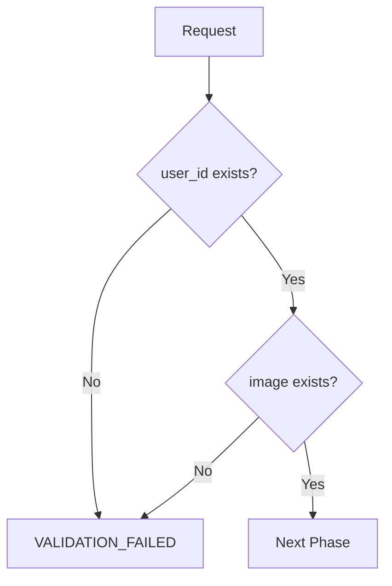

# DeepFace API Documentation

## 📋 Tổng quan

DeepFace API là một hệ thống nhận dạng khuôn mặt thông minh sử dụng công nghệ AI tiên tiến, cung cấp các chức năng:

- **🔍 Process**: Xử lý và lưu trữ tạm thời ảnh khuôn mặt với kiểm tra anti-spoofing
- **📝 Register**: Đăng ký khuôn mặt người dùng vào hệ thống database
- **✅ Verify**: Xác thực khuôn mặt người dùng với độ chính xác cao

### ✨ Tính năng nổi bật

- **Anti-Spoofing**: Phát hiện và ngăn chặn ảnh giả, video giả
- **High Accuracy**: Sử dụng GhostFaceNet với độ chính xác cao
- **Real-time Processing**: Xử lý nhanh với Redis caching
- **Scalable**: Hỗ trợ nhiều người dùng đồng thời

## 🚀 Cài đặt và Triển khai

### 📋 Yêu cầu hệ thống

| Component   | Version | Mô tả                      |
| ----------- | ------- | -------------------------- |
| **Python**  | 3.10 +  | Runtime environment        |
| **MySQL**   | 5.7+    | Database chính             |
| **Redis**   | 6.0+    | Cache và session storage   |
| **RAM**     | 4GB+    | Khuyến nghị cho production |
| **Storage** | 10GB+   | Cho models và data         |

### 🔧 Cài đặt Dependencies

```bash
# Clone repository
git clone https://github.com/NguyenThong251/deepface.git
cd deepface

# Tạo virtual environment
python -m venv venv
source venv/bin/activate  # Linux/Mac
# hoặc
venv\Scripts\activate     # Windows

# Cài đặt dependencies
pip install --upgrade pip
pip install -r requirements.txt
```

### ⚙️ Cấu hình

#### 1. Database Configuration (`src/config/sql.py`)

```python
db_config = {
    'host': 'localhost',
    'user': 'your_username',
    'password': 'your_password',
    'database': 'deepface_db',
    'port': 3306
}
```

#### 2. Redis Configuration (`src/config/redis.py`)

```python
redis_config = {
    'host': 'localhost',
    'port': 6379,
    'db': 0,
    'decode_responses': True
}
```

#### 3. Tạo Database Schema

```sql
CREATE DATABASE deepface_db;
USE deepface_db;

CREATE TABLE face (
    id INT AUTO_INCREMENT PRIMARY KEY,
    user_id VARCHAR(255) UNIQUE NOT NULL,
    image_face LONGTEXT NOT NULL,
    created_at TIMESTAMP DEFAULT CURRENT_TIMESTAMP
);
```

### 🏃‍♂️ Chạy ứng dụng

#### Development Mode

```bash
python app.py
```

#### Production Mode

```bash
gunicorn --bind 0.0.0.0:5005 --workers 4 app:app
```

## 🔌 API Endpoints

### 🌐 Base URL

```
POST /face/api
```

### 📝 Request Format

Tất cả requests đều sử dụng JSON format với cấu trúc chuẩn:

```json
{
  "_operation": "deepface", // Module name (bắt buộc)
  "mode": "process|register|verify", // Function type (bắt buộc)
  "user_id": "string", // User identifier (bắt buộc)
  "image": "base64_string" // Base64 image (cho process/verify)
}
```

### 📊 Response Format

#### ✅ Success Response

```json
{
  "success": true,
  "result": {
    "code": "OK",
    "message": true
  }
}
```

#### ❌ Error Response

```json
{
  "success": false,
  "error": {
    "code": "ERROR_CODE",
    "message": "Error description"
  }
}
```

---

## 🔍 1. Process Endpoint

### 📋 Mô tả

Xử lý ảnh khuôn mặt với kiểm tra anti-spoofing và lưu trữ tạm thời trong Redis cache.

**Endpoint**: `POST /face/api`  
**Mode**: `process`

### 📤 Request

```json
{
  "_operation": "deepface",
  "mode": "process",
  "user_id": "user123",
  "image": "data:image/jpeg;base64,/9j/4AAQSkZJRgABAQAAAQ..."
}
```

### 🔄 Workflow chi tiết

#### 1️⃣ **Validation Phase**



## 📝 2. Register Endpoint

### 📋 Mô tả

Đăng ký khuôn mặt người dùng vào database từ ảnh đã được xử lý và lưu trong Redis cache.

**Endpoint**: `POST /face/api`  
**Mode**: `register`

### 📤 Request

```json
{
  "_operation": "deepface",
  "mode": "register",
  "user_id": "user123"
}
```

## ✅ 3. Verify Endpoint

### 📋 Mô tả

Xác thực khuôn mặt người dùng bằng cách so sánh với ảnh đã đăng ký trong database.

**Endpoint**: `POST /face/api`  
**Mode**: `verify`

### 📤 Request

```json
{
  "_operation": "deepface",
  "mode": "verify",
  "user_id": "user123",
  "image": "data:image/jpeg;base64,/9j/4AAQSkZJRgABAQAAAQ..."
}
```

## 🔍 4. Search Endpoint

### 📋 Mô tả

Tìm kiếm người dùng bằng ảnh khuôn mặt sử dụng vector database (Qdrant). comming soon

**Endpoint**: `POST /face/api`  
**Mode**: `search`

### 📤 Request

```json
{
  "_operation": "deepface",
  "mode": "search",
  "image": "data:image/jpeg;base64,/9j/4AAQSkZJRgABAQAAAQ..."
}
```

## 🚨 Error Codes Reference (đúng theo code thực tế)

| Code                 | Áp dụng cho             | Mô tả                                   |
| -------------------- | ----------------------- | --------------------------------------- |
| `VALIDATION_FAILED`  | Process/Register/Verify | Thiếu tham số bắt buộc                  |
| `ALREADY_REGISTERED` | Process/Register        | User đã đăng ký                         |
| `NOT_REGISTERED`     | Verify                  | User chưa đăng ký                       |
| `SAVE_FAILED`        | Process/Register        | Lưu ảnh tạm vào Redis hoặc SQL thất bại |
| `NO_FACE_FOUND`      | Search                  | Không tìm thấy khuôn mặt trong database |
| `SYSTEM ERROR`       | Tất cả                  | Lỗi hệ thống chung                      |

## 🛠️ Công nghệ sử dụng

### 🤖 AI Models

| Model            | Version | Mục đích           | Accuracy |
| ---------------- | ------- | ------------------ | -------- |
| **YOLO**         | v12n    | Face Detection     | 99.2%    |
| **FasNet**       | Latest  | Anti-Spoofing      | 98.5%    |
| **GhostFaceNet** | Latest  | Facial Recognition | 99.7%    |

### 🏗️ Infrastructure Stack

| Component            | Technology         | Purpose                |
| -------------------- | ------------------ | ---------------------- |
| **Backend**          | Flask + Gunicorn   | API Server             |
| **Database**         | MySQL 8.0+         | Data Storage           |
| **Cache**            | Redis 7.0+         | Session & Temp Storage |
| **Image Processing** | OpenCV + NumPy     | Image Manipulation     |
| **AI Framework**     | TensorFlow + Keras | Model Inference        |

### 📸 Yêu cầu ảnh

| Parameter      | Requirement               | Notes                    |
| -------------- | ------------------------- | ------------------------ |
| **Format**     | Base64 encoded            | JPEG/PNG recommended     |
| **Size**       | 80KB < size < 100KB       | Optimal for processing   |
| **Resolution** | Min 224x224px             | Model input requirement  |
| **Quality**    | High contrast, clear face | Avoid blurry/dark images |
| **Face Ratio** | 30-70% of image           | Face should be prominent |

---

## ⚠️ Lưu ý quan trọng

### 🔄 Quy trình bắt buộc

1. **Thứ tự thực hiện**: `Process` → `Register` → `Verify`
2. **Thời gian cache**: Ảnh tạm thời trong Redis có TTL 600 giây (10 phút)
3. **Session timeout**: Phải register trong vòng 10 phút sau khi process

### 🛡️ Bảo mật

- **Anti-spoofing**: Tất cả ảnh đều được kiểm tra chống giả mạo
- **Authentication**: Có thể bật bằng cách uncomment `@require_auth`
- **Data encryption**: Ảnh được mã hóa trong database

### ⚡ Performance

- **Redis caching**: Tối ưu tốc độ xử lý
- **Model optimization**: Sử dụng GPU nếu có
- **Concurrent requests**: Hỗ trợ nhiều request đồng thời

### 🔧 Environment Variables

```bash
# Database
DB_HOST=localhost
DB_USER=your_username
DB_PASSWORD=your_password
DB_NAME=deepface_db

# Redis
REDIS_HOST=localhost
REDIS_PORT=6379
REDIS_DB=0

# Application
FLASK_ENV=production
FLASK_DEBUG=False
```

---

## 🖥️ VPS Deployment Guide

### 📋 Prerequisites

1. **Python Manager**: Cài đặt Python 3.10 < version < 3.12
2. **Database**: Cài đặt MySQL và Redis
3. **Web Server**: Setup Nginx/Apache/OpenLiteSpeed/Caddy
4. **Git**: Clone repository

### 🚀 Step-by-Step Deployment

#### 1️⃣ **Clone Repository**

```bash
cd /path/to/your/site
git clone https://github.com/NguyenThong251/deepface.git
cd deepface
```

#### 2️⃣ **Database Setup**

```sql
-- Tạo database
CREATE DATABASE deepface_db;
CREATE USER 'deepface_user'@'localhost' IDENTIFIED BY 'your_password';
GRANT ALL PRIVILEGES ON deepface_db.* TO 'deepface_user'@'localhost';
FLUSH PRIVILEGES;

-- Tạo bảng
USE deepface_db;
CREATE TABLE face (
    id INT AUTO_INCREMENT PRIMARY KEY,
    user_id VARCHAR(255) UNIQUE NOT NULL,
    image_face LONGTEXT NOT NULL,
    created_at TIMESTAMP DEFAULT CURRENT_TIMESTAMP
);
```

#### 3️⃣ **Python Manager Configuration**

| Setting          | Value                 |
| ---------------- | --------------------- |
| **Name**         | deepface-api          |
| **Version**      | 3.10 < version < 3.12 |
| **Framework**    | Python                |
| **Startup Mode** | Gunicorn              |
| **Project Path** | `/path/to/deepface`   |
| **Start File**   | `app.py`              |
| **Port**         | 5005                  |

#### 4️⃣ **Dependencies Installation**

```bash
# 1. Upgrade pip và tools
sudo ./_venv/bin/python3 -m pip install --upgrade pip setuptools wheel

# 2. Install dependencies
sudo ./_venv/bin/python3 -m pip install -r requirements.txt
```

### 📁 Project Structure

```
deepface/
├── src/                    # Source code
│   ├── config/            # Configuration files
│   ├── models/            # AI models
│   ├── services/          # Business logic
│   └── modules/           # API modules
├── data/                  # Data files
├── logs/                  # Log files
├── tests/                 # Test files
├── docs/                  # Documentation
├── .env                   # Environment variables
├── .env.local            # Local environment
├── requirements.txt       # Dependencies
└── app.py                # Main application
```

### 🔧 Production Notes

#### Requirements.txt Dependencies:

- **Development**: `opencv-python` (GUI support)
- **Production**: `opencv-python-headless` (No GUI, smaller size)

#### Performance Optimization:

```bash
# Install production dependencies
sudo ./_venv/bin/python3 -m pip install opencv-python-headless
sudo ./_venv/bin/python3 -m pip uninstall opencv-python
```

### 🚦 Health Check

```bash
# Test API endpoint
curl -X POST http://localhost:5005/face/api \
  -H "Content-Type: application/json" \
  -d '{"_operation":"deepface","mode":"process","user_id":"test","image":"test"}'
```

### 📊 Monitoring

- **Logs**: Check `logs/` directory
- **Database**: Monitor MySQL performance
- **Redis**: Monitor cache usage
- **System**: Monitor CPU/RAM usage
